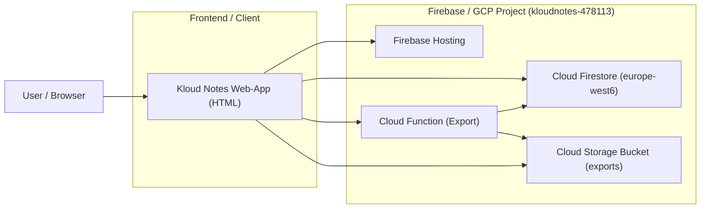

```mermaid
flowchart LR
  user["User / Browser"]
  
  subgraph frontend["Frontend / Client"]
    app["Kloud Notes Web-App (HTML)"]
  end

  subgraph firebase["Firebase / GCP Project (kloudnotes-478113)"]
    hosting["Firebase Hosting"]
    firestore["Cloud Firestore (europe-west6)"]
    bucket["Cloud Storage Bucket (exports)"]
    func["Cloud Function (Export)"]
  end

  user --> app
  app --> hosting

  app --> firestore

  app --> func
  func --> firestore
  func --> bucket
  app --> bucket


```